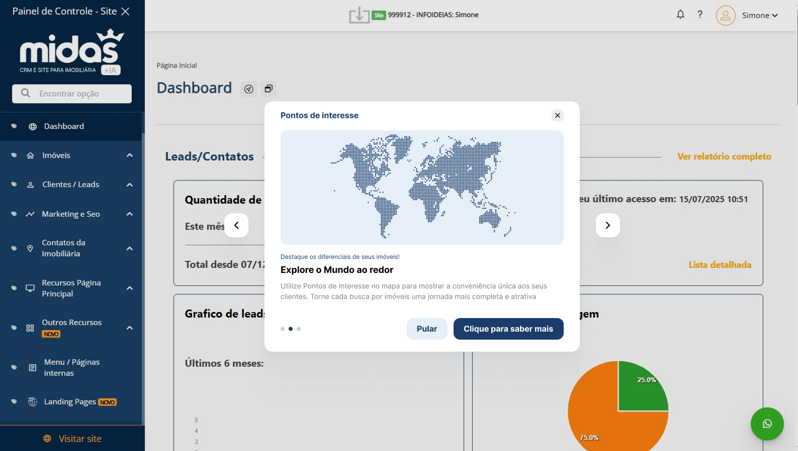
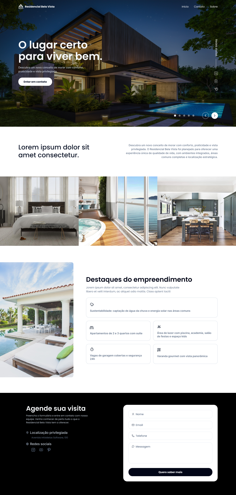

# Exercício 1 – Análise Crítica e Redesenho de Pop-up

## Node redesign

## Analise do novo design

O novo design do pop-up foi desenvolvido com o objetivo de melhorar a experiência do usuário e tornar a interface mais intuitiva. A seguir, estão os principais pontos de análise:

1. **Layout Limpo e Organizado**: O novo design apresenta um layout mais limpo, com uma organização clara dos elementos. Isso facilita a compreensão das informações apresentadas.
2. **Uso de Cores**: As cores foram escolhidas para serem mais agradáveis aos olhos e para destacar as informações mais importantes. A paleta de cores é consistente com a identidade visual do produto.
3. **Tipografia**: A tipografia foi aprimorada para garantir uma melhor legibilidade e uma hierarquia visual mais clara. Títulos e textos foram ajustados para facilitar a leitura.
4. **Botões de Ação**: Os botões de ação foram reposicionados e estilizados para serem mais visíveis e intuitivos. Eles agora possuem um tamanho adequado e cores que contrastam bem com o fundo, facilitando a interação do usuário.

# 🎨 Exercício 2 – Criação de Layout para Landing Page

